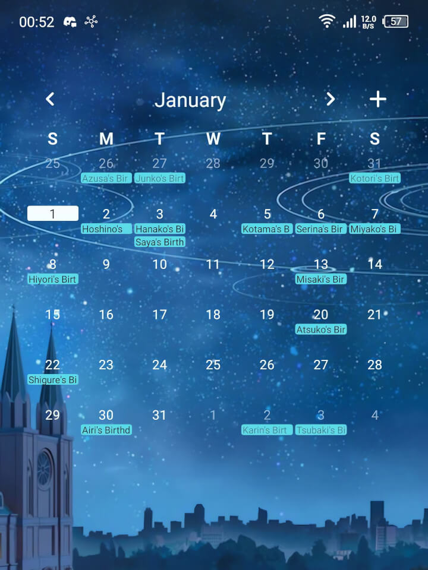

# BA-student-birthday
Collection of Blue Archive student birthdays, stored in iCalendar media type (ics). [iCalendar](https://en.wikipedia.org/wiki/ICalendar) is an open format and used by many calendar softwares.
This was made to allow people to import the data into their preferred apps, including offline and mobile calendars.

#### Using The Calendar
1. Download `ba-student-birthday.ics` file 
2. Import the file to your digital calendar.

If your calendar supports importing calendars by URL, using [this link](https://raw.githubusercontent.com/simpelplant/BA-student-birthday/main/ba-student-birthday.ics) might work as well.

---
[Blue Archive](https://en.wikipedia.org/wiki/Blue_Archive)(c) by [Nexon](https://en.wikipedia.org/wiki/Nexon)
